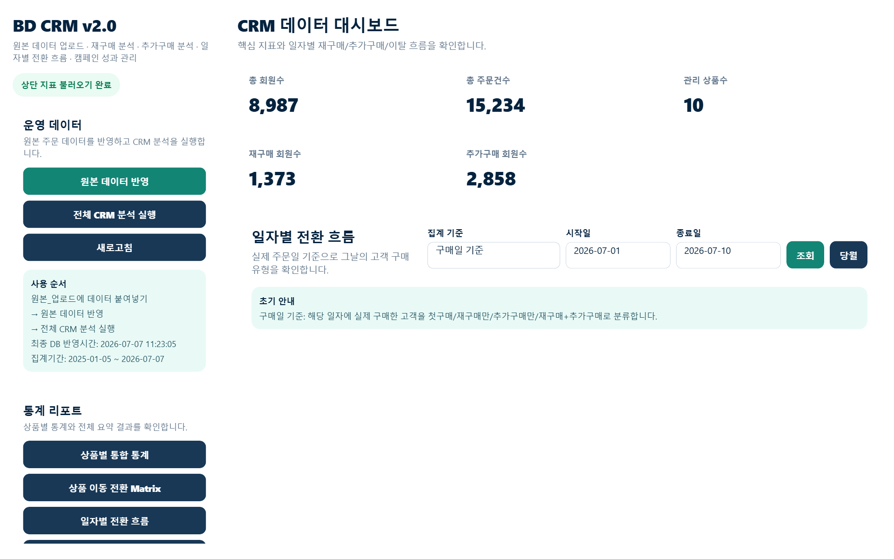
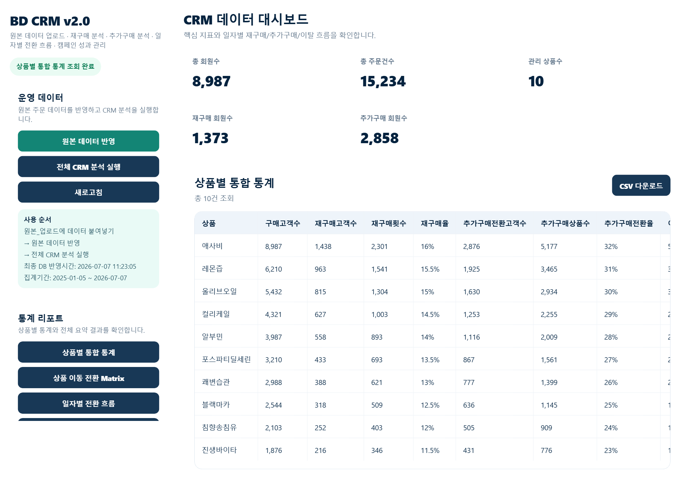
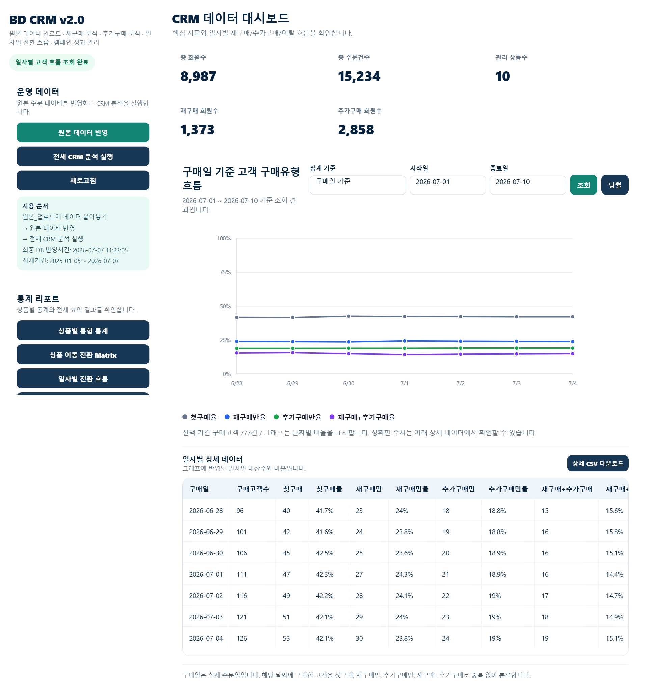

# BD CRM Analytics

이커머스 주문 데이터를 기반으로 **재구매율 · 추가구매(Cross-sell) 전환율 · 이탈률**을 자동 분석하고, 마케팅 타겟 고객을 즉시 추출할 수 있는 CRM 분석 도구입니다. Google Sheets를 데이터베이스로, Google Apps Script를 백엔드로 사용하는 서버리스 웹앱으로 구현했습니다.

## 배경

반복 구매가 중요한 이커머스 비즈니스에서 "어떤 상품이 재구매로 이어지는지", "어떤 고객이 이탈 직전인지"를 스프레드시트 수작업으로 매번 집계하는 데는 한계가 있습니다. 이 프로젝트는 원본 주문 데이터를 업로드하면 재구매/추가구매/이탈 지표를 자동으로 계산하고, 마케팅 액션이 필요한 고객 리스트까지 바로 뽑아주는 것을 목표로 합니다.

## 핵심 기능

- **상품별 통합 통계** — 상품마다 구매고객수 대비 재구매고객수·재구매횟수·추가구매 전환·이탈고객수를 한 표에서 비교
- **일자별 전환 흐름** — 두 가지 기준으로 고객 흐름을 추적
  - 구매일 기준: 그날 구매한 고객을 첫구매/재구매만/추가구매만/재구매+추가구매로 분류
  - 재구매 도래일 기준: 과거 구매일 + 상품별 재구매 주기(구매수량 반영)로 산출한 "판정일"에 실제 재구매/추가구매/미구매 여부 판정
- **상품 이동 전환 Matrix** — A 상품 구매 고객이 B 상품으로 전환된 경로를 시각화
- **CRM 대상자 조회** — 조건별(상품, 경과일 등)로 재구매/추가구매 타겟 고객 리스트를 즉시 추출
- **캠페인 관리** — 캠페인 계획을 기록하고 성과를 조회

## 스크린샷

| 대시보드 | 상품별 통합 통계 | 일자별 전환 흐름 |
|---|---|---|
|  |  |  |

## 기술 스택

- **Backend**: Google Apps Script (V8 runtime)
- **Frontend**: HTML/CSS/Vanilla JS (Apps Script `HtmlService`)
- **Database**: Google Sheets (원본 주문 데이터 → 정규화된 DB 시트 → 집계 리포트 시트)
- **Tooling**: [clasp](https://github.com/google/clasp) 기반 로컬 개발 및 CI 배포

## 아키텍처

```
원본_업로드 (수작업 붙여넣기)
      │  원본 데이터 반영
      ▼
원본_DB (정규화된 주문 원장, ~2만 행)
      │  전체 CRM 분석 실행
      ▼
CRMAnalysisService  ──▶  상품별 통합 통계 / 일자별 전환 흐름 / 상품 이동 Matrix / 대시보드
      │
      ▼
웹앱 대시보드 (HtmlService, google.script.run으로 서버 함수 호출)
```

## 트러블슈팅: 분석 실행 55초 → 24초, 특정 리포트 27초 → 2초

기능 개발보다 흥미로웠던 부분은 성능 디버깅이었습니다. "전체 CRM 분석 실행" 버튼이 실사용 환경에서 55초 넘게 걸린다는 리포트를 받고, 추측 대신 **직접 계측**하는 방식으로 접근했습니다.

1. **가설 없이 계측부터** — 각 계산 단계(`getRecords_`, `buildDashboard`, `buildDailyConversionTrend` 등)에 타임스탬프 로그를 심어 `Logger.log`로 병목 구간을 특정했습니다.
2. **가장 큰 병목 발견** — "일자별 전환 흐름" 계산 한 단계가 27초, 전체의 절반을 차지했습니다. 원인은 주문 1건마다 `Session.getScriptTimeZone()` / `Utilities.formatDate()`라는 Apps Script 네이티브 브릿지 호출을 반복하고 있었던 것 — 순수 JS 연산보다 훨씬 비싼 호출을 2만 번 가까이 반복하고 있었습니다. 같은 날짜는 결과가 항상 동일하다는 점에 착안해 **메모이제이션 캐시**를 도입해 27초 → 2초로 줄였습니다.
3. **O(n²) 알고리즘 수정** — 재구매 판정 로직이 레코드마다 회원 전체 주문을 다시 필터링하고 있어 사실상 O(n²)으로 동작했습니다. 이미 만들어져 있던 회원별 그룹 캐시를 재사용하도록 바꿔 중복 스캔을 제거했습니다.
4. **요청 간 캐시 vs 세션 내 캐시 구분** — 한 번의 "전체 분석 실행" 안에서 5개 리포트가 각각 DB를 다시 읽던 부분은 인스턴스 캐시로, 페이지를 열 때마다 매번 2만 행을 다시 스캔하던 "집계기간" 계산은 분석 실행 시점에 미리 계산해 시트에 캐싱해두는 방식으로 각각 다르게 풀었습니다.
5. **전수 조회 대신 타겟 조회** — 고객 1명을 검색하는 기능이 매번 전체 주문을 다 읽고 있던 것을, 주문자ID 컬럼만 먼저 조회해 대상 행만 골라 읽는 방식으로 바꿨습니다.

수정 전후 결과가 완전히 동일한지는 실제 데이터로 old/new 로직을 함께 돌려 자동 비교하는 검증 스크립트를 짜서 확인한 뒤에만 반영했습니다.

## 알고 있는 한계 / 다음 개선 방향

- **캠페인 성과 분석**은 현재 UI만 존재하고 실제 성과 계산 로직은 미구현 상태입니다(캠페인 기준 정의가 먼저 필요). 다음 개발 우선순위로 남겨두었습니다.
- 재구매 판정에는 현재 기간 제한이 없습니다(예: 1년 전 재구매도 재구매로 집계). 비즈니스 요구에 따라 판정 기간 옵션을 추가할 수 있습니다.

## 로컬 개발

```bash
npm install -g @google/clasp
clasp login
clasp clone <scriptId>
clasp push       # 코드를 Apps Script 프로젝트에 반영
clasp deploy -i <deploymentId>   # 배포된 웹앱에 반영
```
